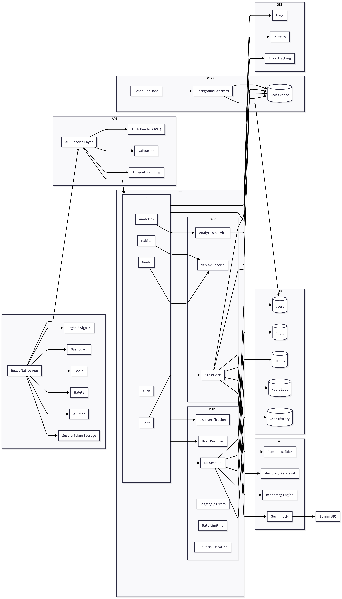
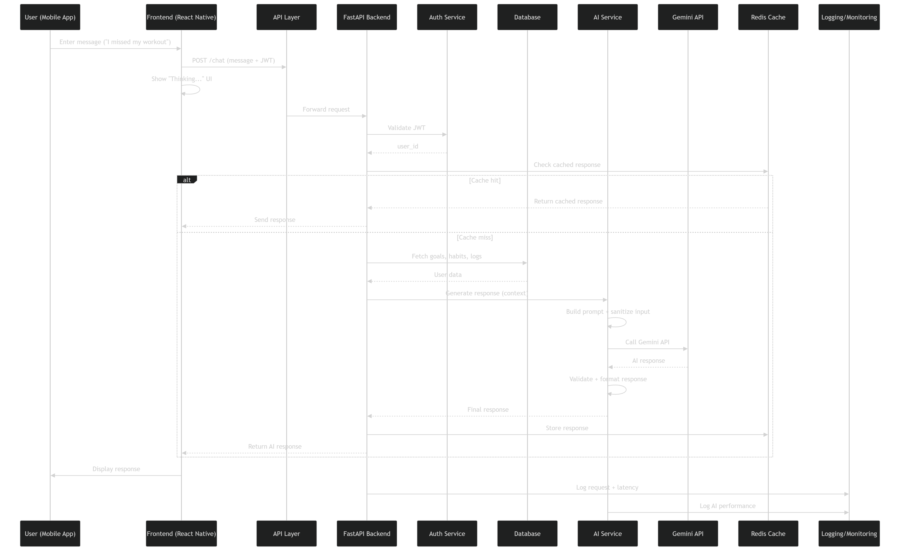

# AI Coach - Intelligent Habit and Goal Tracking System

AI Coach is a full-stack application that combines habit tracking, goal management, and AI-driven coaching into a single system.

It helps users stay consistent, track progress, and receive actionable guidance based on their real behavior.

---

## What This App Does

### Goals
- Create goals with deadlines
- View and manage goal progress

### Habits
- Create habits
- Log daily activity (done or missed)
- Track last 7 days
- Automatic streak calculation

### AI Coaching
- Chat with an AI coach
- Responses are based on:
  - User goals
  - Habits
  - Recent activity

Example:

User: I missed my workout yesterday
AI: Acknowledge it and restart with a lighter session today instead of skipping entirely.

---

## User Experience
- Fast API responses for core features
- Optimistic UI updates
- Loading states and error handling
- Mobile-friendly interface (Expo React Native)

---

## Tech Stack

### Backend
- FastAPI
- SQLAlchemy
- Pydantic v2
- JWT Authentication

### Frontend
- React Native (Expo)
- Fetch API (centralized API layer)

### AI
- Gemini API
- Prompt engineering and context injection

---

## 🏗️ System Architecture

The system follows a layered architecture separating client, backend, AI, and data layers.

<p align="center">
  
</p>

## 🔄 Chat Request Flow

The following sequence diagram shows how a chat request is processed end-to-end:

<p align="center">
  
</p>

---

## Setup

### Backend

```bash
python -m venv venv
venv\Scripts\activate
pip install -r app/requirements.txt
uvicorn app.main:app --host 0.0.0.0 --port 8000
```

API docs:

```text
http://localhost:8000/docs
```

### Frontend

```bash
cd frontend
npm install
npx expo start
```

---

## Maintenance

### Remove Duplicate Habit Logs

Dry run:

```bash
python -m app.scripts.cleanup_habit_log_duplicates
```

Apply cleanup:

```bash
python -m app.scripts.cleanup_habit_log_duplicates --apply
```

---

## Current Status
- Full-stack app working end-to-end
- Multi-user system implemented
- AI integration functional
- Frontend and backend fully connected

This is a complete working application.

---

## What Is Pending

### Performance Improvements
- Add AI response caching
- Reduce prompt size dynamically
- Skip AI for simple queries (smart routing)
- Optimize database queries

### AI Improvements
- Add chat history (short-term memory)
- Add long-term user memory
- Personalization based on behavior
- Retrieval-Augmented Generation (RAG)

### Production Enhancements
- Redis caching
- Background workers
- Rate limiting
- Monitoring and logging
- Cloud deployment

---

## Vision

AI Coach aims to evolve into a system that:

- Understands user behavior over time
- Adapts coaching dynamically
- Provides personalized insights
- Scales efficiently for multiple users

---

## Summary

### Completed
- Authentication system
- Goals and habits tracking
- Habit streak logic
- AI-based coaching
- Clean frontend experience

### Remaining
- Performance optimization
- AI memory and personalization
- Production infrastructure

---

## Positioning

Basic CRUD App

down arrow

AI-Enabled Application

down arrow

Production-Grade Intelligent System (In Progress)
